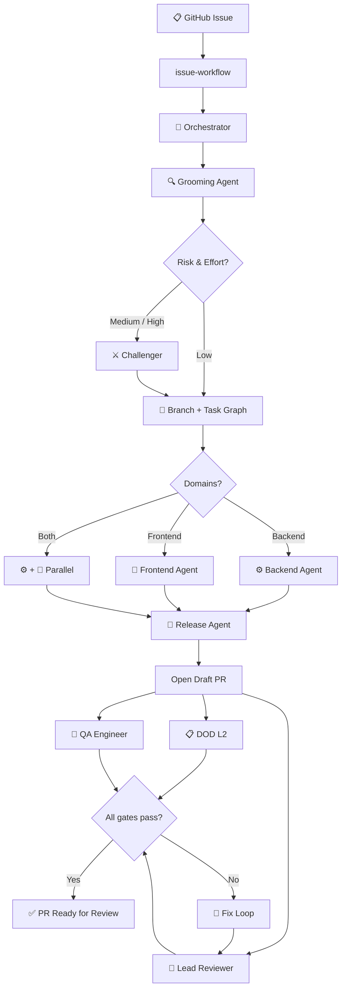

<div align="center">

```
███╗   ███╗ █████╗ ███████╗███████╗████████╗██████╗  ██████╗
████╗ ████║██╔══██╗██╔════╝██╔════╝╚══██╔══╝██╔══██╗██╔═══██╗
██╔████╔██║███████║█████╗  ███████╗   ██║   ██████╔╝██║   ██║
██║╚██╔╝██║██╔══██║██╔══╝  ╚════██║   ██║   ██╔══██╗██║   ██║
██║ ╚═╝ ██║██║  ██║███████╗███████║   ██║   ██║  ██║╚██████╔╝
╚═╝     ╚═╝╚═╝  ╚═╝╚══════╝╚══════╝   ╚═╝   ╚═╝  ╚═╝ ╚═════╝
```

**One baton. Any orchestra.**

*A Claude Code plugin that conducts the full delivery pipeline — from GitHub issue to merged PR — without you lifting a finger.*

---

[](https://claude.ai/code)
[](LICENSE)
[](https://github.com/wp-media/maestro/releases)

</div>

---

## What Is Maestro?

Maestro is a **Claude Code plugin** that conducts a complete, production-grade AI delivery pipeline for any project.

Install it once. Wire it to your repo in two minutes. Then watch twelve specialised agents pick up a GitHub issue, write the spec, implement the code, open the PR, and self-correct — all from a single command.

```
/issue-workflow 42
```

No prompt engineering. No agent babysitting. No score that drifts out of sync across repos.

---

## Install

```
/plugin marketplace add wp-media/claude-marketplace
/plugin install maestro@wp-media
```

Then wire your project:

```
/maestro:onboard-project
```

That's it. The pipeline is active.

---

## The Pipeline

Every run follows the same path — from issue to ready-to-review PR:



---

## The Agents

Twelve specialists. Each one has a single job.

| Agent | Role |
|---|---|
| `orchestrator` *(skill)* | Central coordinator — runs inline, routes everything |
| `grooming-agent` | Reads the issue, maps the codebase, writes the spec |
| `challenger` | Adversarial reviewer — finds what grooming missed |
| `backend-agent` | PHP implementation, TDD, docs, DOD L1 |
| `frontend-agent` | JS/CSS/HTML implementation, DOD L1 |
| `lead-reviewer` | Code review against spec and architecture rules |
| `qa-engineer` | Tests the PR against acceptance criteria |
| `e2e-qa-tester` | Browser QA via Playwright MCP |
| `release-agent` | Pushes branch, creates draft PR |
| `ticket-writer` | Creates well-formed GitHub issues for follow-ups |

---

## One Score, Any Ensemble

Every agent reads a single config file — `.claude/maestro.json` — committed in your repo. The score is the same. Only the ensemble changes.

```
Without Maestro                    With Maestro
─────────────────────              ──────────────────────────────
project-a/                         Maestro plugin (installed once)
  .claude/agents/ ──┐                agents/        ← one score, always current
  .claude/skills/ ──┤                commands/      ← one score, always current
     (drifting)    │
                   │              project-a/
project-b/         │                .claude/maestro.json   ← ensemble identity
  .claude/agents/ ──┤
  .claude/skills/ ──┤              project-b/
   (older, drifted) │                .claude/maestro.json   ← ensemble identity
                   │
project-c/         │              project-c/
  .claude/agents/ ──┘                .claude/maestro.json   ← ensemble identity
  (oldest, most diverged)
```

**Updates are automatic.** When Maestro ships a new movement, every ensemble picks it up on the next Claude session — no action needed.

---

## Config

One file, everything tunable:

<details>
<summary><strong>Minimal setup</strong></summary>

```jsonc
{
  "ai": {
    "slug":               "my-plugin",
    "display_name":       "My Plugin",
    "repo":               "my-org/my-plugin",
    "temp_root":          ".maestro",
    "base_branch":        "origin/develop",
    "architecture_skill": "my-plugin-architecture",
    "frontend_skill":     null,
    "editions":           null,
    "e2e": {
      "settings_path":    null,
      "ci_integration":   false,
      "license_option_key": null
    }
  }
}
```

</details>

<details>
<summary><strong>Full WordPress plugin example</strong></summary>

```jsonc
{
  "ai": {
    "slug":         "wp-rocket",
    "display_name": "WP Rocket",
    "repo":         "my-org/wp-rocket",
    "temp_root":    ".maestro",
    "base_branch":  "origin/develop",

    "architecture_skill":  "wp-rocket-architecture",
    "frontend_skill":      "wp-rocket-frontend-architecture",

    "text_domain":    "rocket",
    "namespace":      "WP_Rocket",
    "rest_namespace": "/wp-json/wp-rocket/v1/",
    "capabilities":   ["rocket_manage_options"],

    "editions": null,

    "e2e": {
      "local_url":      "http://localhost:8888",
      "settings_path":  "/wp-admin/options-general.php?page=wprocket",
      "ci_integration": false
    }
  }
}
```

</details>

<details>
<summary><strong>Multi-edition plugin (free + pro)</strong></summary>

```jsonc
{
  "ai": {
    "slug":         "my-plugin",
    "display_name": "My Plugin",
    "repo":         "my-org/my-plugin-pro",
    "temp_root":    ".maestro",
    "editions":     ["free", "pro"],

    "e2e": {
      "settings_path":   "/wp-admin/admin.php?page=my-plugin",
      "ci_integration":  false
    }
  }
}
```

</details>

---

## Commands

| Command | What it does |
|---|---|
| `/maestro` | Show the full command map — quick reference for new users |
| `/maestro:onboard-project` | Wire a new project — writes `maestro.json`, scaffolds dirs |
| `/maestro:transplant <path>` | Generate a bespoke issue-workflow for any target project |
| `/maestro:issue-workflow 42` | Run the full delivery pipeline from a GitHub issue |
| `/maestro:orchestrator` | Jump straight into routing if the issue is already loaded |
| `/maestro:dod` | Run the Definition of Done checklist on the current branch |
| `/maestro:docs` | Update developer documentation |
| `/maestro:e2e` | Run E2E smoke tests manually |
| `/maestro:knowledge-graph` | Explore codebase dependencies |
| `/maestro:compliance` | Check a change against WordPress.org rules |
| `/maestro:sprint` | Plan and estimate issues for a sprint |

> **Looking for changelog, PR description, test-writing, or retrospective commands?** These are now available as standalone agents in [Cadenza](https://github.com/wp-media/cadenza) — a companion plugin that pairs with Maestro.

**Autonomy flags** — pass on any `/maestro:issue-workflow` run:

| Flag | Effect |
|---|---|
| `--sequential` | Run everything one at a time (useful on limited platforms) |
| `"stay close to this"` | High-oversight mode — Claude pauses and asks more |
| `"just ship it"` | High-autonomy mode — Claude decides and moves fast |

---

## Observability

Pair Maestro with **[Podium](https://github.com/wp-media/podium)** — a real-time dashboard that visualises every agent spawn, tool call, and session event at zero token cost.

```
/plugin install podium@wp-media
/podium start   →   http://localhost:4820
```

---

## Releasing a New Version

1. Merge `develop` into `trunk`
2. Bump `version` in `.claude-plugin/plugin.json`
3. Tag the release (e.g. `v0.4.0`) on `trunk`

Every project picks up the update automatically on the next Claude session.

---

## Repository Layout

```
maestro/
│
├── AGENTS.md                                ← Base guardrails every project extends
├── .claude-plugin/
│   └── plugin.json                          ← Claude Code plugin manifest
├── .claude/
│   └── settings.json                        ← SessionStart hook (reads maestro.json)
│
├── .template/
│   └── maestro.json                         ← Full config schema
│
├── agents/                                  ← 12 fully config-driven agents
│
├── commands/                                ← Skills (slash commands)
│   ├── orchestrator.md
│   ├── onboard-project.md
│   ├── issue-workflow.md
│   └── …
│
└── specs/phpcs/                             ← Recurring PHPCS fix patterns
```

---

<div align="center">

*Raise the baton.*

</div>
