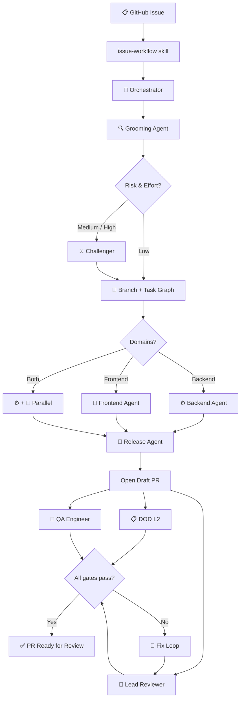

<div align="center">

```
███╗   ███╗ █████╗ ███████╗███████╗████████╗██████╗  ██████╗
████╗ ████║██╔══██╗██╔════╝██╔════╝╚══██╔══╝██╔══██╗██╔═══██╗
██╔████╔██║███████║█████╗  ███████╗   ██║   ██████╔╝██║   ██║
██║╚██╔╝██║██╔══██║██╔══╝  ╚════██║   ██║   ██╔══██╗██║   ██║
██║ ╚═╝ ██║██║  ██║███████╗███████║   ██║   ██║  ██║╚██████╔╝
╚═╝     ╚═╝╚═╝  ╚═╝╚══════╝╚══════╝   ╚═╝   ╚═╝  ╚═╝ ╚═════╝
```

**One baton, many orchestras.**

*Maestro holds the agents, skills, and orchestration logic that every wp-media plugin plays from — each tuned to its own codebase, all moving in sync.*

---

[](https://github.com/wp-media/wp-rocket)
[](https://github.com/wp-media/backwpup-pro)
[](https://github.com/wp-media/imagify-plugin)

</div>

---

## ♩ What Is Maestro?

Before Maestro, each plugin had its own copy of the AI pipeline in `.aiassistant/` — agents, skills, scripts — and they were drifting apart. A fix to the orchestrator in one project never reached the others. A better agent design sat in WP Rocket while Imagify ran an older version.

Maestro is the single source of truth. Projects no longer *own* the pipeline — they *tune* it.

```
Without Maestro                    With Maestro
─────────────────────              ─────────────────────────────
wp-rocket/                         maestro/
  .aiassistant/agents/ ──┐           .claude/agents/           ← one copy
  .aiassistant/skills/ ──┤           .claude/commands/         ← one copy
                         │           .claude/specs/            ← one copy
backwpup/                │
  .aiassistant/agents/ ──┤         wp-rocket/
  .aiassistant/skills/ ──┤           .claude/maestro.json      ← identity only
         (older, drifted)│           .claude/commands/wp-rocket-architecture.md
                         │
imagify/                 │         backwpup/
  .aiassistant/agents/ ──┘           .claude/maestro.json      ← identity only
  .aiassistant/skills/               .claude/commands/backwpup-architecture.md
         (oldest, most diverged)
```

---

## 🎼 The Pipeline

Every delivery run follows the same score — from GitHub issue to merged PR:



---

## 🗂️ The Score

```
maestro/
│
├── AGENTS.md                                ← Base guardrails every project extends
├── plugin.json                              ← Claude Code plugin manifest
├── .template/
│   └── repo-map.json                        ← Full config schema — copy to .claude/maestro.json
│
├── bin/
│   └── sync-pipeline.sh                     ← Fallback: pull updates manually (idempotent)
│
└── .claude/                                 ← Claude Code native home (auto-distributed)
    │
    ├── agents/                              ← 9 fully config-driven agents
    │   ├── grooming-agent.md                  Analyses issues, writes implementation specs
    │   ├── challenger.md                      Adversarial spec reviewer
    │   ├── backend-agent.md                   PHP implementation + tests + docs
    │   ├── frontend-agent.md                  JS/CSS/template implementation
    │   ├── lead-reviewer.md                   Code review against spec and standards
    │   ├── qa-engineer.md                     Validates PR against acceptance criteria
    │   ├── release-agent.md                   Pushes branch and creates PR
    │   ├── ticket-writer.md                   Creates well-formed GitHub issues
    │   └── e2e-qa-tester.md                   Browser QA via Playwright MCP
    │
    ├── commands/                            ← Skills (slash commands)
    │   ├── orchestrator.md                  ← Central pipeline coordinator (~900 lines)
    │   ├── orchestrator/
    │   │   └── html-log-format.md           ← Live run log format spec
    │   ├── dod.md                           ← Definition of Done (L1 self-check + L2 gate)
    │   ├── docs.md                          ← Developer documentation updater
    │   ├── e2e.md                           ← E2E test execution (basic + extended tiers)
    │   ├── issue-workflow.md                ← Entry point: issue number → full pipeline
    │   ├── issue-workflow/
    │   │   ├── refs/pr-template.md
    │   │   └── scripts/
    │   │       ├── issue-sync.sh            ← Fetch & snapshot GitHub issues locally
    │   │       ├── make-issue-branch.sh     ← Create convention-named branch
    │   │       ├── init-pr-draft.sh         ← Initialise PR body from template
    │   │       └── slack-notify.js          ← Forward pipeline events to Slack
    │   ├── knowledge-graph.md               ← Codebase dependency graph reader
    │   └── wordpress-compliance.md          ← WP.org + PHPCS compliance rules
    │
    └── specs/phpcs/                         ← Recurring PHPCS fix patterns
        ├── escaped-output.md
        ├── nonce-verification-recommended.md
        └── validated-sanitized-input.md
```

---

## 🎛️ Tuning Your Instrument

Every project tells Maestro who it is through a single file:

**`.claude/maestro.json`** → `ai` section

Agents read this at startup. Nothing is hardcoded.

```jsonc
{
  // ... existing project structure fields (areas, tooling, etc.) ...

  "ai": {
    // ── Identity ─────────────────────────────────────────────────────────────
    "slug":         "wp-rocket",                 // used in temp file paths
    "display_name": "WP Rocket",                 // used in prose and GitHub comments
    "repo":         "wp-media/wp-rocket",        // all gh CLI calls use this

    // ── Temp / coordination ───────────────────────────────────────────────────
    "temp_root":    ".TemporaryItems/Issues/wp-rocket",

    // ── Skills ────────────────────────────────────────────────────────────────
    "architecture_skill":  "wp-rocket-architecture",
    "frontend_skill":      "wp-rocket-frontend-architecture",  // null if not applicable

    // ── WordPress ─────────────────────────────────────────────────────────────
    "text_domain":    "rocket",
    "namespace":      "WP_Rocket",
    "rest_namespace": "/wp-json/wp-rocket/v1/",  // null if not applicable
    "capabilities":   ["rocket_manage_options", "rocket_purge_cache"],

    // ── Pipeline behaviour ────────────────────────────────────────────────────
    "push_agent":  "release-agent",
    "editions":    null,            // ["free","pro"] for BackWPup — drives scope splitting

    // ── Slack (optional) ─────────────────────────────────────────────────────
    "slack_channel":     "C0B680PH44T",
    "slack_threads_dir": ".TemporaryItems/Issues/wp-rocket/slack-threads",

    // ── Local dev / E2E ───────────────────────────────────────────────────────
    "e2e": {
      "local_url":     "http://localhost:8888",
      "boot_cmd":      "bash bin/dev-up.sh",
      "seed_cmd":      null,                     // e.g. "bash bin/dev-seed.sh"
      "test_cmd":      null,                     // e.g. "bash bin/test-e2e.sh"
      "settings_path": "/wp-admin/options-general.php?page=wprocket",
      "ci_integration": false  // true = e2e-qa-tester commits specs permanently
    }
  }
}
```

<details>
<summary><strong>View BackWPup example (editions split)</strong></summary>

```jsonc
"ai": {
  "slug":         "backwpup",
  "display_name": "BackWPup",
  "repo":         "wp-media/backwpup-pro",
  "temp_root":    ".TemporaryItems/Issues/backwpup",

  "architecture_skill": "backwpup-architecture",
  "frontend_skill":     null,

  "text_domain": "backwpup",
  "namespace":   "BackWPup",
  "rest_namespace": null,

  "push_agent": "release-agent",
  "editions":   ["free", "pro"],   // ← orchestrator splits scope by edition boundary

  "e2e": {
    "local_url":      "http://localhost:8888",
    "boot_cmd":       "bash bin/dev-up.sh",
    "settings_path":  "/wp-admin/admin.php?page=backwpup",
    "ci_integration": false
  }
}
```
</details>

<details>
<summary><strong>View Imagify example (permanent E2E suite)</strong></summary>

```jsonc
"ai": {
  "slug":         "imagify-plugin",
  "display_name": "Imagify",
  "repo":         "wp-media/imagify-plugin",
  "temp_root":    ".TemporaryItems/Issues/imagify-plugin",

  "architecture_skill": "imagify-architecture",
  "frontend_skill":     "imagify-frontend-architecture",

  "text_domain": "imagify",
  "namespace":   "Imagify",

  "push_agent": "release-agent",
  "editions":   null,

  "e2e": {
    "local_url":      "http://localhost:8888",
    "boot_cmd":       "bash bin/dev-up.sh",
    "seed_cmd":       "bash bin/dev-seed.sh",
    "test_cmd":       "bash bin/test-e2e.sh",
    "settings_path":  "/wp-admin/admin.php?page=imagify-settings",
    "ci_integration": true   // ← e2e-qa-tester commits specs to tests/e2e/
  }
}
```
</details>

---

## 🎵 Joining the Orchestra

Five steps to onboard a new project:

**1. Copy the config template**
```bash
cp maestro/.template/repo-map.json <project>/.claude/maestro.json
```

**2. Fill in the `ai` section** — every field the agents need to know about your project.

**3. Write your architecture skill**
```bash
# Write .claude/commands/<slug>-architecture.md — define your DI patterns, module structure, static analysis rules
```

**4. Write your `AGENTS.md`** — start from Maestro's base, add your **Project Overview** and leave room for **Session Learnings** at the bottom.

**5. Sync the pipeline** (one-time setup, then auto-updated)
```bash
MAESTRO_DIR=/path/to/maestro bash /path/to/maestro/bin/sync-pipeline.sh
```

That's it. The next `/issue-workflow <N>` starts the full pipeline.

---

## 🔄 Keeping in Sync

When Maestro is updated (better agents, fixed skills, new features), every project picks it up with one command:

```bash
# From the project root
MAESTRO_DIR=/path/to/maestro bash /path/to/maestro/bin/sync-pipeline.sh

# Or dry-run first to see what would change
MAESTRO_DIR=/path/to/maestro bash /path/to/maestro/bin/sync-pipeline.sh --dry-run
```

The sync script is **idempotent** and **safe to re-run**. It copies agents, commands, and specs into the project's `.claude/` directory — and never touches:

| Protected | Why |
|---|---|
| `.claude/maestro.json` | Your project's identity and config |
| `.claude/commands/<slug>-architecture.md` | Your codebase's unique rules |
| `.claude/graph/` | Auto-generated from your code |
| `AGENTS.md` | Your Project Overview and Session Learnings |

---

## 🎺 The Players

### Agents

| Agent | Role |
|---|---|
| `orchestrator` *(skill)* | Central coordinator — runs inline, spawns all others |
| `grooming-agent` | Reads the issue, maps the code, writes the spec |
| `challenger` | Adversarial reviewer — finds what grooming missed |
| `backend-agent` | PHP implementation, TDD, docs, DOD L1 |
| `frontend-agent` | JS/CSS/template implementation, DOD L1 |
| `lead-reviewer` | Code review against spec + architecture rules |
| `qa-engineer` | Tests the PR against acceptance criteria |
| `e2e-qa-tester` | Browser QA via Playwright MCP, screenshots via Gist |
| `release-agent` | Pushes branch, creates draft PR, labels |
| `ticket-writer` | Creates well-formed GitHub issues for follow-ups |

### Skills & Specs

| Skill / Spec | Purpose |
|---|---|
| `orchestrator/SKILL.md` | Full pipeline: routing, loop counters, escalation, HTML log |
| `dod/SKILL.md` | Definition of Done — L1 (self-check) and L2 (independent gate) |
| `docs/SKILL.md` | Updates developer docs when public API changes |
| `e2e/SKILL.md` | Two-tier E2E: basic (smoke) and extended (full QA) |
| `issue-workflow/SKILL.md` | Entry point: `/task 42` → full pipeline |
| `knowledge-graph/SKILL.md` | Reads the pre-built codebase dependency graph |
| `wordpress-compliance/SKILL.md` | WordPress.org + PHPCS compliance rules |
| `specs/phpcs/*.md` | Fix patterns for recurring PHPCS warnings |

---

## 🔑 Running the Pipeline

With Claude Code, the pipeline is one slash command away:

```
/issue-workflow
```

Type an issue number and Claude runs the full pipeline end to end — grooming → (challenger) → branch → implementation → DOD L2 → lead review → QA → PR ready.

```
/issue-workflow 123
/issue-workflow 123 --sequential
/issue-workflow 123 just ship it
```

You can also invoke the orchestrator directly (if you've already fetched the issue):

```
/orchestrator
```

Other available slash commands once synced:

| Command | When to use |
|---|---|
| `/issue-workflow` | **Start here.** Fetches the issue, then hands off to the orchestrator |
| `/orchestrator` | Jump straight into routing if the issue is already fetched |
| `/dod` | Run the Definition of Done checklist on the current branch |
| `/knowledge-graph` | Explore codebase dependencies before making structural changes |
| `/wordpress-compliance` | Check a file or change against WordPress.org rules |
| `/e2e` | Run E2E smoke tests (basic tier) manually |
| `/docs` | Update developer documentation for the current branch |

Autonomy flags (append to any `/issue-workflow` call):
- `--sequential` — run everything one-at-a-time (useful for debugging)
- `"I want to stay close to this"` → high-oversight mode (more check-ins before each gate)
- `"just ship it"` → high-autonomy mode (only escalates on hard blockers)

---

## 🔄 Keeping Maestro Updated

The pipeline lives in one place. When it improves, every project can pick it up.

### Option A — Git submodule + sync script (current approach)

Add Maestro as a submodule once per project:

```bash
git submodule add https://github.com/wp-media/maestro .maestro
```

Update and sync whenever Maestro ships changes:

```bash
git submodule update --remote .maestro && MAESTRO_DIR=.maestro bash .maestro/bin/sync-pipeline.sh
```

Pin the submodule to a specific release tag for stability. Bump it deliberately, like any other dependency.

### Option B — GitHub Actions auto-PR (recommended)

The gold standard: zero human effort, human still approves.

**In Maestro** (`.github/workflows/notify-projects.yml`):
```yaml
on:
  push:
    branches: [main]
jobs:
  dispatch:
    runs-on: ubuntu-latest
    steps:
      - uses: peter-evans/repository-dispatch@v3
        with:
          token: ${{ secrets.MAESTRO_PAT }}
          repository: wp-media/wp-rocket
          event-type: maestro-updated
      # repeat for backwpup-pro, imagify-plugin
```

**In each project** (`.github/workflows/sync-maestro.yml`):
```yaml
on:
  repository_dispatch:
    types: [maestro-updated]
  schedule:
    - cron: '0 9 * * 1'   # fallback: every Monday at 9am

jobs:
  sync:
    runs-on: ubuntu-latest
    steps:
      - uses: actions/checkout@v4
        with: { submodules: true }
      - run: git submodule update --remote .maestro
      - run: MAESTRO_DIR=.maestro bash .maestro/bin/sync-pipeline.sh
      - uses: peter-evans/create-pull-request@v6
        with:
          title: "chore: sync AI pipeline from Maestro"
          branch: chore/sync-maestro
          commit-message: "chore: sync AI pipeline from Maestro"
```

Push to Maestro → PRs open automatically in all three projects → humans review and merge.

---

<div align="center">

*Built at wp-media for WP Rocket, BackWPup & Imagify.*

</div>
