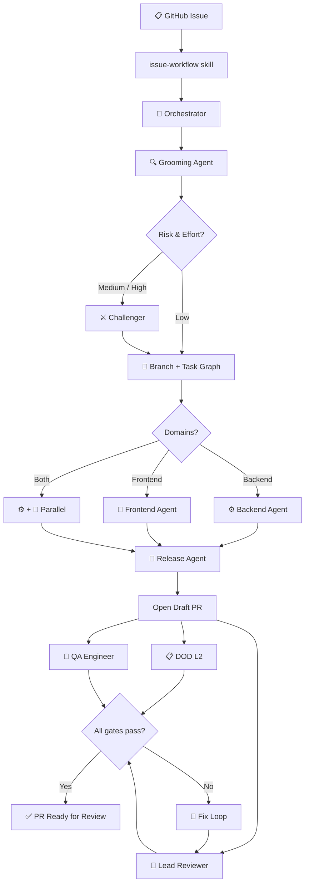

<div align="center">

```
███╗   ███╗ █████╗ ███████╗███████╗████████╗██████╗  ██████╗
████╗ ████║██╔══██╗██╔════╝██╔════╝╚══██╔══╝██╔══██╗██╔═══██╗
██╔████╔██║███████║█████╗  ███████╗   ██║   ██████╔╝██║   ██║
██║╚██╔╝██║██╔══██║██╔══╝  ╚════██║   ██║   ██╔══██╗██║   ██║
██║ ╚═╝ ██║██║  ██║███████╗███████║   ██║   ██║  ██║╚██████╔╝
╚═╝     ╚═╝╚═╝  ╚═╝╚══════╝╚══════╝   ╚═╝   ╚═╝  ╚═╝ ╚═════╝
```

**One baton, many orchestras.**

*Maestro holds the agents, skills, and orchestration logic that every wp-media plugin plays from — each tuned to its own codebase, all moving in sync.*

---

[](https://github.com/wp-media/wp-rocket)
[](https://github.com/wp-media/backwpup-pro)
[](https://github.com/wp-media/imagify-plugin)

</div>

---

## What Is Maestro?

Maestro is a **Claude Code plugin** — a single source of truth for the AI delivery pipeline shared across all wp-media projects.

Every engineer installs it once. Every project tunes it through a single committed config file. When Maestro ships a new release, everyone picks it up automatically.

```
Without Maestro                    With Maestro
─────────────────────              ──────────────────────────────
wp-rocket/                         Maestro plugin (installed once)
  .claude/agents/ ──┐                agents/        ← one copy
  .claude/skills/ ──┤                commands/      ← one copy
         (drifting) │
                    │              wp-rocket/
backwpup/           │                .claude/maestro.json   ← identity only
  .claude/agents/ ──┤                .claude/commands/wp-rocket-architecture.md
  .claude/skills/ ──┤
    (older, drifted)│              backwpup/
                    │                .claude/maestro.json   ← identity only
imagify/            │                .claude/commands/backwpup-architecture.md
  .claude/agents/ ──┘
  .claude/skills/
  (oldest, most diverged)
```

---

## Installing the Plugin

Run these two commands once in Claude Code:

```
/plugin marketplace add wp-media/maestro
/plugin install maestro@maestro
```

That's it. The pipeline is available in every project you open.

**Updates are automatic.** When wp-media publishes a new Maestro release, Claude picks it up — no CLI, no settings, no action needed from you.

---

## The Pipeline

Every delivery run follows the same score — from GitHub issue to merged PR:



---

## Repository Layout

```
maestro/
│
├── AGENTS.md                                ← Base guardrails every project extends
├── .claude-plugin/
│   ├── plugin.json                          ← Claude Code plugin manifest
│   └── marketplace.json                     ← Self-serve marketplace definition
│
├── .template/
│   └── maestro.json                         ← Full config schema — copy to .claude/maestro.json
│
└── .claude/                                 ← Plugin content (agents + skills)
    │
    ├── agents/                              ← 9 fully config-driven agents
    │   ├── grooming-agent.md
    │   ├── challenger.md
    │   ├── backend-agent.md
    │   ├── frontend-agent.md
    │   ├── lead-reviewer.md
    │   ├── qa-engineer.md
    │   ├── release-agent.md
    │   ├── ticket-writer.md
    │   └── e2e-qa-tester.md
    │
    ├── commands/                            ← Skills (slash commands)
    │   ├── orchestrator.md
    │   ├── orchestrator/
    │   │   └── html-log-format.md
    │   ├── dod.md
    │   ├── docs.md
    │   ├── e2e.md
    │   ├── issue-workflow.md
    │   ├── issue-workflow/
    │   │   ├── refs/pr-template.md
    │   │   └── scripts/
    │   ├── knowledge-graph.md
    │   └── wordpress-compliance.md
    │
    └── specs/phpcs/                         ← Recurring PHPCS fix patterns
        ├── escaped-output.md
        ├── nonce-verification-recommended.md
        └── validated-sanitized-input.md
```

---

## Onboarding a New Project

### 1. Run the onboarding skill

Open the project in Claude and run:

```
/onboard-project
```

Maestro will discover what it can (repo, plugin name, namespace, text domain, tooling, directory structure) and ask for the rest in a single prompt. It writes `.claude/maestro.json` for you.

### 2. Write your architecture skill

```bash
# .claude/commands/<slug>-architecture.md
# Define your DI patterns, module structure, static analysis rules.
```

The grooming agent reads this before every implementation. It's the most important project-specific file.

### 3. Write your `AGENTS.md`

Start from Maestro's base (`AGENTS.md` in this repo). Add a **Project Overview** section and leave room for **Session Learnings** at the bottom.

### 4. Run the pipeline

```
/issue-workflow 42
```

---

## Tuning Your Project

Agents read `.claude/maestro.json` at session start. Nothing is hardcoded.

<details>
<summary><strong>WP Rocket example</strong></summary>

```jsonc
"ai": {
  "slug":         "wp-rocket",
  "display_name": "WP Rocket",
  "repo":         "wp-media/wp-rocket",
  "temp_root":    ".TemporaryItems/Issues/wp-rocket",

  "architecture_skill":  "wp-rocket-architecture",
  "frontend_skill":      "wp-rocket-frontend-architecture",

  "text_domain":    "rocket",
  "namespace":      "WP_Rocket",
  "rest_namespace": "/wp-json/wp-rocket/v1/",
  "capabilities":   ["rocket_manage_options", "rocket_purge_cache"],

  "push_agent": "release-agent",
  "editions":   null,

  "slack_channel":     "C0B680PH44T",
  "slack_threads_dir": ".TemporaryItems/Issues/wp-rocket/slack-threads",

  "e2e": {
    "local_url":     "http://localhost:8888",
    "boot_cmd":      "bash bin/dev-up.sh",
    "settings_path": "/wp-admin/options-general.php?page=wprocket",
    "ci_integration": false
  }
}
```
</details>

<details>
<summary><strong>BackWPup example (editions split)</strong></summary>

```jsonc
"ai": {
  "slug":         "backwpup",
  "display_name": "BackWPup",
  "repo":         "wp-media/backwpup-pro",
  "temp_root":    ".TemporaryItems/Issues/backwpup",

  "architecture_skill": "backwpup-architecture",
  "frontend_skill":     null,

  "text_domain": "backwpup",
  "namespace":   "BackWPup",

  "push_agent": "release-agent",
  "editions":   ["free", "pro"],

  "e2e": {
    "local_url":     "http://localhost:8888",
    "boot_cmd":      "bash bin/dev-up.sh",
    "settings_path": "/wp-admin/admin.php?page=backwpup",
    "ci_integration": false
  }
}
```
</details>

---

## Running the Pipeline

```
/issue-workflow 123
/issue-workflow 123 --sequential
/issue-workflow 123 just ship it
```

| Command | When to use |
|---|---|
| `/onboard-project` | **Start here for new projects.** Creates `.claude/maestro.json` from the codebase |
| `/issue-workflow` | Start the delivery pipeline from a GitHub issue number |
| `/orchestrator` | Jump straight into routing if the issue is already loaded |
| `/dod` | Run the Definition of Done checklist on the current branch |
| `/knowledge-graph` | Explore codebase dependencies |
| `/wordpress-compliance` | Check a change against WordPress.org rules |
| `/e2e` | Run E2E smoke tests manually |
| `/docs` | Update developer documentation |

Autonomy flags:
- `--sequential` — run everything one-at-a-time
- `"I want to stay close to this"` → high-oversight mode
- `"just ship it"` → high-autonomy mode

---

## Releasing a New Version

1. Merge your changes to `main`
2. Bump `version` in `.claude-plugin/plugin.json`
3. Create a GitHub Release with a matching tag (e.g. `v1.1.0`)

Every engineer using the plugin picks up the update automatically on their next Claude session — no action required.

---

## The Players

| Agent | Role |
|---|---|
| `orchestrator` *(skill)* | Central coordinator — runs inline, spawns all others |
| `grooming-agent` | Reads the issue, maps the code, writes the spec |
| `challenger` | Adversarial reviewer — finds what grooming missed |
| `backend-agent` | PHP implementation, TDD, docs, DOD L1 |
| `frontend-agent` | JS/CSS/template implementation, DOD L1 |
| `lead-reviewer` | Code review against spec + architecture rules |
| `qa-engineer` | Tests the PR against acceptance criteria |
| `e2e-qa-tester` | Browser QA via Playwright MCP |
| `release-agent` | Pushes branch, creates draft PR, labels |
| `ticket-writer` | Creates well-formed GitHub issues for follow-ups |

---

<div align="center">

*Built at wp-media for WP Rocket, BackWPup & Imagify.*

</div>
